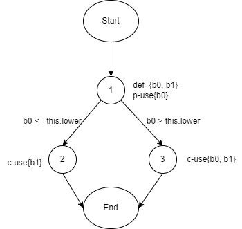

**SENG 438 - Software Testing, Reliability, and Quality**

**Lab. Report #3 – Code Coverage, Adequacy Criteria and Test Case Correlation**

| Group: 8        |
| --------------- |
| Jiawei He       |
| Nicholas Garcia |
| Sarah Qin       |
| Findlay Brown   |

(Note that some labs require individual reports while others require one report
for each group. Please see each lab document for details.)

# 1 Introduction

This assignment focuses on JUnit testing and testing tools using white-box coverage criteria technique for test suites. The objective of this assignment is to equip students with the adequacy of a white-box test suite based on code coverage.

In order to measure the adequacy of a test suite, this assignment covers control-flow coverage criteria such as statement coverage, decision coverage, condition coverage and path coverage, and data-flow coverage criteria such as DU pairs coverage.

# 2 Manual data-flow coverage calculations for X and Y methods

1. Data Flow Graph
   - DataUtilities.calculateColumnTotal

   
   - Range.Intersects

   
1. the def-use sets per statement
   - DataUtilities.calculateColumnTotal
   - Range.Intersects
1. list all DU-pairs per variable
   - DataUtilities.calculateColumnTotal
     - data: (1, 1), (1, 3), (1, 5), (1, 12)
     - column: (1, 5), (1, 12)
     - total: (2, 7), (2, 10), (15, 15)
     - rowCount: (3, 4), (3, 9)
     - r: (4, 4), (4, 5), (4, 8)
     - n: (5, 7), (5, 12), (5, 13), (5, 15)
     - r2: (9, 12), (9, 14)
   - Range.Intersects
     - b0: (1, 1), (1, 3)
     - b1: (1, 2), (1, 3)
1. for each test case show which pairs are covered
   - DataUtilities.calculateColumnTotal
   - Range.Intersects
     - (1, 1), (1, 2), (1, 3)
1. calculate the DU-Pair coverage.
   - DataUtilities.calculateColumnTotal
   - Range.Intersects

# 3 A detailed description of the testing strategy for the new unit test

After determining the coverage metrics from the test suites in assignment 2, we would look at the source files of Range and DataUtilities and look for line coverage information.

Green represents a 100% line coverage of the specifc line. Yellow represents partial line coverage of the specific line. In the screenshot above, the if statement is partially covered as the conditional is always true. Red represents a line that is not covered by any test case.

Using this information, test cases are created to maximize the amount of green lines in the class source files. Maximizing the amount of green lines will increase the coverage metrics needed to fulfill the requirements of the assignment.

# 4 A high level description of five selected test cases you have designed using coverage information, and how they have increased code coverage

Prior to developing new unit tests with the help of code coverage tools, our old test suite from Assignment 2 revealed an overall branch and line coverage of 31.2% and 45.8% respectively for the DataUtilities class.

We were able to successfully increase the branch and line coverage close to 90% for the DataUtilities class, primarily as a result of designing new test cases for the methods that previously had the lowest coverage metrics at 0%.

5 test cases that increased code coverage are shown below as examples:

1. emptyData_ReturnZero()
   - Method Tested: calculateColumnTotal(Values2D data, int column, int[] validRows)
   - Input Arguments: 
      - data: Empty Values2D object
      - column: Index 0
      - validRows: No valid rows
   - Expected Return: 0 (No values are added up)

   

2. validColsIncludesInvalidColumns_ignoresInvalidColumns()
   - Method Tested: calculateRowTotal(Values2D data, int row, int[] validCols)
   - Input Arguments: 
      - data: 5x5 Values2D object filled at row index 2 with the value "1"
      - row: Index 2
      - validCols: Valid columns at indices 0-4, and invalid columns at indices 5-6
   - Expected Return: 5 (Only values at valid columns 0-4 are added up)

   

3. matching_Null_returnTrue()
   - Method Tested: equal(double[][] a, double[][] b)
   - Input Arguments: 
      - a: null
      - b: null
   - Expected Return: True (Arrays a and b are equal)

   

4. validSource_2D_doubleArray_returnClone()
   - Method Tested: clone(double[][] source)
   - Input Arguments: 
      - source: 2x2 array filled with values 1,2,3,4
   - Expected Return: Exact same array as the input argument "source"

   

5. nullSource_throwIllegalArgumentException()
   - Method Tested: clone(double[][] source)
   - Input Arguments: 
      - source: null
   - Expected Result: IllegalArgumentException

   

# 5 A detailed report of the coverage achieved of each class and method (a screen shot from the code cover results in green and red color would suffice)

## ***Coverage Metrics of DataUtilities Before Changes Were Made***

Branch coverage of DataUtilities

Line coverage of DataUtilities

Method coverage of DataUtilities

## ***Coverage Metrics of DataUtilities After Changes Were Made***

Branch coverage of DataUtilities

Line coverage of DataUtilities

Method coverage of DataUtilities

## ***Coverage Metrics of Range Before Changes Were Made***

Branch coverage of Range

Line coverage of Range

Method coverage of Range

## ***Coverage Metrics of Range After Changes Were Made***

Branch coverage of Range

Line coverage of Range 

Method coverage of Range

# 6 Pros and Cons of coverage tools used and Metrics you report

Pros of Branch/Decision coverage metric:
   - Good for identifying the correctness of code logic
   - Valuable for code sections containing complex logic

Cons of Branch/Decision coverage metric:
   - Resource intensive for simple logic code sections
   - Difficult to achieve close to 100% coverage
   - More complicated to implement and interpret

Pros of Statement/Line coverage metric:
   - Useful for finding dead code
   - Easier to achieve close to 100% coverage
   - Less complicated to implement and interpret

Cons of Statement/Line coverage metric:
   - Doesn't specifically indicate the correctness of code logic
   - Less effective for code sections containing complex logic

For coverage tools, we tried using EclEmma in the Eclipse IDE as well as IntelliJ IDEA. The advantages and disadvantages we discovered for each are as follows:

EclEmma:
   - Very intuitive to get started with its straightforward featuresets
   - Requires manual installation as a plugin for the default Eclipse IDE
   - Better dedicated coverage report feature
   - Multiple coverage report file formats for export

IntelliJ:
   - Less intuitive to learn with its advanced featuresets
   - Easiest to set up with its built-in coverage analysis
   - Better coverage highlight feature in the editor
   - More flexible coverage indications throughout the IDE

# 7 A comparison on the advantages and disadvantages of requirements-based test generation and coverage-based test generation.

***Advantages and Disadvantages of Requirements-Based Testing Generation***

Testing based on requirements helps pinpoint bugs by concentrating on known functionalities, avoiding unnecessary metrics. While this approach streamlines bug discovery, challenges may arise in deciding how many test cases are needed, possibly resulting in redundant and time-consuming tests that offer little value.

***Advantages and Disadvantages of Coverage-Based Testing Generation***

Generating tests based on coverage ensures a clear requirement for the number of tests in a project, offering a measurable metric to gauge testing completeness. Developers discover untested code areas and functionalities when striving to enhance coverage. However, a downside is the risk of testers prioritizing coverage metrics over addressing real issues, leading to undetected bugs in a codebase with high coverage metrics.

Requirements-based testing pinpoints bugs by focusing on known functionalities, avoiding unnecessary metrics, but may lead to challenges in determining test quantity. Coverage-based testing ensures clear test quantity requirements, offering a measurable metric for completeness, yet poses a risk of testers prioritizing metrics over addressing real issues, potentially leading to undetected bugs in a highly covered codebase. Balancing these approaches is crucial for effective testing.

# 8 A discussion on how the team work/effort was divided and managed

The team was split into pairs to develop the test suites using the white-box testing method. Test cases for all methods of the DataUtilities class was assigned to Findlay- and Javy, and all methods of the Range class was assigned to Sarah and Nick. Each pair was also responsible for developing the data flow diagram for a method of their respective classes. After finishing, we examined each other's tests to identify any inconsistencies or flaws in the testing methodology and to ensure compliance with JUnit testing code standards.

# 9 Any difficulties encountered, challenges overcome, and lessons learned from performing the lab

Some difficulties we encountered were trying to create test cases for lines that were impossible to reach. Based on the source code, some of the lines in methods were impossible to reach making us unable to increase the coverage metrics for certain methods. A challenge we overcame was determining which coverage metrics from our coverage tool to look at to ensure we meet the requirements of the assignment, as some coverage metrics had different names than those we learned in lecture. We learned is that coverage-based testing is a great tool for creating test cases, but should be combined with other test generation strategies such as requirement-based testing because coverage-based may miss some cases that other strategies could find.

# 10 Comments/feedback on the lab itself

The lab provided a comprehensive understanding of whitebox testing with the use of JUnit and test coverage metrics. We liked how the tests we develop showed immediate results for coverage metrics and gave us great insight on what kind of tests should be developed for future projects.
